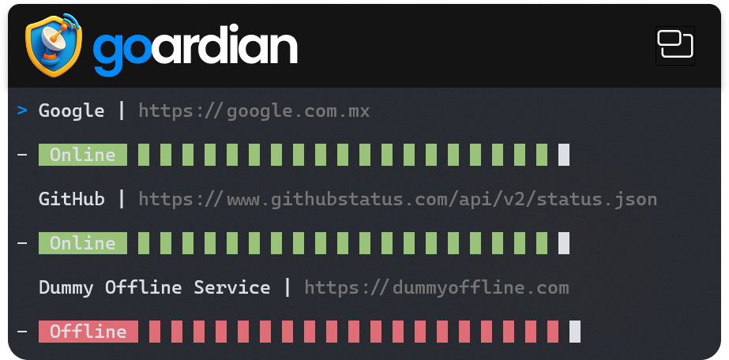

# Goardian 🛡️

A simple terminal-based HTTP service health checker built with Go and Bubble Tea. Monitor your web services with real-time status updates and visual health indicators.



## Features

- **Real-time Monitoring**: Continuously monitor HTTP endpoints with customizable intervals
- **Visual Health Indicators**: Color-coded status bars showing service health history
- **Multiple HTTP Methods**: Support for GET, POST, PUT, DELETE, PATCH, HEAD, and OPTIONS
- **Flexible Configuration**: Configure request delays, preferred status codes, and SSL verification
- **Interactive TUI**: Beautiful terminal user interface with keyboard navigation
- **SQLite Storage**: Persistent service configuration storage
- **JSON Payload Support**: Send custom JSON payloads for POST requests
- **SSL/TLS Options**: Configure insecure skip verify for development environments

## Installation

### Prerequisites

- Go 1.24.5 or later
- Git (for cloning the repository)

### Quick Start

1. Clone the repository:
```bash
git clone https://github.com/DigitalArtifactory/goardian.git
cd goardian/goardian
```

2. Install dependencies:
```bash
go mod tidy
```

3. Run the application:
```bash
go run .
```

## Usage

### Keyboard Shortcuts

#### Main List View
- `n` - Create a new service
- `Enter` - Edit selected service
- `d` - Delete selected service
- `r` - Restart status history for selected service
- `↑/k` - Move up in the list
- `↓/j` - Move down in the list
- `q` - Quit the application

#### Service Configuration
- `Enter` - Continue to next field or save
- `Esc` - Go back to previous field or cancel

### Adding a Service

1. Press `n` to create a new service
2. Enter the following information step by step:
   - **Service Name**: A descriptive name for your service
   - **Method**: HTTP method (GET, POST, PUT, DELETE, PATCH, HEAD, OPTIONS)
   - **Endpoint**: Full URL including protocol (http:// or https://)
   - **Payload**: JSON payload for POST requests (optional)
   - **Request Delay**: Delay between requests in milliseconds (optional)
   - **JSON Property**: Specific JSON property to monitor (optional)
   - **Preferred Status**: Expected HTTP status code (100-599)
   - **Insecure Skip Verify**: Skip SSL certificate verification (true/false)

### Example Service Configuration

```
Service Name: My API
Method: GET
Endpoint: https://api.example.com/health
Payload: (empty for GET requests)
Request Delay: 5000
JSON Property: (empty)
Preferred Status: 200
Insecure Skip Verify: false
```

## Health Status Indicators

- 🟢 **Green**: Service is online and responding with the expected status code
- 🔴 **Red**: Service is offline or responding with an unexpected status code
- **Status Bar**: Shows the last 20 health checks as colored blocks

## Configuration

Services are automatically saved to a local SQLite database (`goardian.db`) in the application directory. The database is created automatically on first run.

## Dependencies

- [Bubble Tea](https://github.com/charmbracelet/bubbletea) - Terminal UI framework
- [Bubbles](https://github.com/charmbracelet/bubbles) - Common UI components
- [Lipgloss](https://github.com/charmbracelet/lipgloss) - Style definitions
- [SQLite3](https://github.com/mattn/go-sqlite3) - Database driver
- [UUID](https://github.com/google/uuid) - UUID generation

## Development

### Project Structure

```
goardian/
├── main.go          # Application entry point
├── model.go         # Bubble Tea model and business logic
├── view.go          # UI rendering and styling
├── store.go         # Database operations and data models
├── go.mod           # Go module definition
├── go.sum           # Dependency checksums
├── portrait.png     # Application screenshot
└── goardian.db      # SQLite database (created at runtime)
```

### Building

To build a standalone executable:

```bash
go build -o goardian .
```

## Contributing

Contributions are welcome! Please feel free to submit a Pull Request.

## License

This project is licensed under the Apache License 2.0 - see the [LICENSE](LICENSE) file for details.

## Author

Created by **[DavidArtifacts](https://github.com/DavidArtifacts)** at [Digital Artifactory](https://github.com/DigitalArtifactory)

---

*Monitor your services with confidence using Goardian! 🛡️*